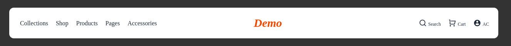

# 🚀 Header Section Practice

👨‍💻 Developed by: Mahin Hasan
📅 Date: July 18, 2025

---

## ✅ What I Practiced Today

- Header layout with **Flexbox**
- Responsive navbar using **Tailwind CSS**
- CTA button & hover effect
- Mobile-friendly menu design

---

## 📸 Preview




---

## 📂 Files Included

```bash
header/
├── header1.html
├── header2.html
```
